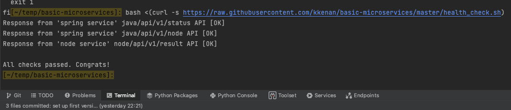

# Ahmed Pašić

# Simple Microservices Project - Dockerized

## Description

Both microservices were dockerized. "spring-boot-app" is inside a folder of the same name.
Same goes for "node-app". Inside the Dockerfiles all needed steps were included, which also
includes the cloning of the git repo that contains the microservices.
Some unusual or harder to explain steps are explained through comments in the exact file.
The postgres database needed for the proper work of the services is also included in the
docker compose.

## How to run the containers

Execute: 
```
docker-compose up
```

The next image shows that the health checks finished successfully:

